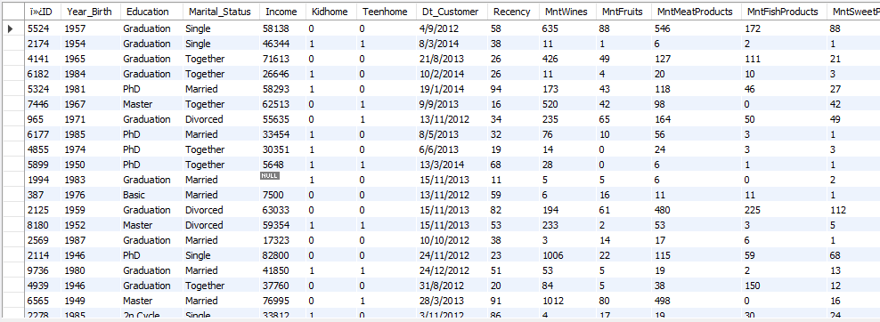
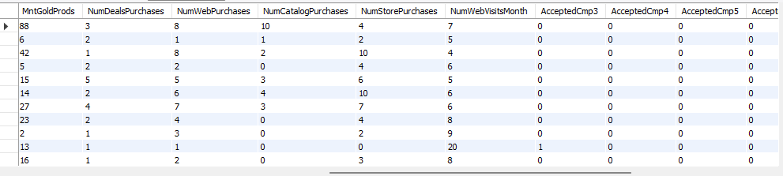
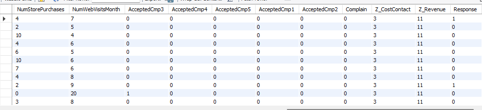
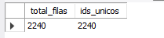
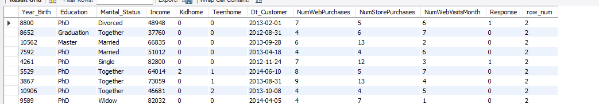
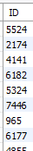
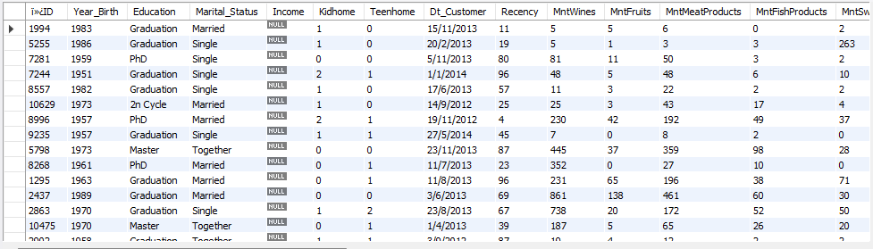
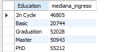
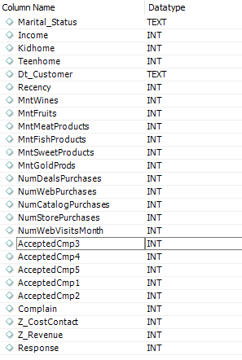
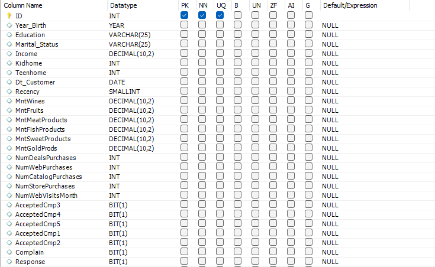

 Descripción del Dataset

El conjunto de datos utilizado en este proyecto corresponde a una base de datos de marketing que contiene información sobre clientes,
su comportamiento de compra y su interacción con diferentes campañas promocionales de una empresa.

El objetivo principal del dataset es analizar el comportamiento de los clientes y predecir qué usuarios tienen mayor probabilidad de responder positivamente a una campaña de marketing.
Este tipo de análisis permite a las empresas optimizar sus estrategias comerciales, mejorar la segmentación de clientes y aumentar la eficiencia de las campañas promocionales.

La base de datos incluye información demográfica de los clientes, datos relacionados con sus ingresos, composición del hogar, historial de compras y nivel de interacción con los diferentes canales de venta de la empresa.

Además, el dataset registra la respuesta de los clientes a varias campañas de marketing anteriores, lo que permite evaluar el impacto de las estrategias de comunicación y desarrollar modelos predictivos orientados a identificar clientes con mayor probabilidad de aceptar una oferta.


Este tipo de dataset es comúnmente utilizado en proyectos de análisis de marketing, segmentación de clientes y desarrollo de modelos de predicción de respuesta a campañas. 


### Principales variables del dataset
### Descripción de las variables del dataset
| Variable | Descripción |
|----------|-------------|
| ID | Identificador único del cliente |
| Year_Birth | Año de nacimiento del cliente |
| Education | Nivel educativo del cliente |
| Marital_Status | Estado civil del cliente |
| Income | Ingreso anual del hogar del cliente |
| Kidhome | Número de niños pequeños en el hogar |
| Teenhome | Número de adolescentes en el hogar |
| Dt_Customer | Fecha en la que el cliente se registró en la empresa |
| Recency | Número de días desde la última compra |
| MntWines | Monto gastado en vinos en los últimos 2 años |
| MntFruits | Monto gastado en frutas en los últimos 2 años |
| MntMeatProducts | Monto gastado en productos cárnicos en los últimos 2 años |
| MntFishProducts | Monto gastado en productos de pescado en los últimos 2 años |
| MntSweetProducts | Monto gastado en productos dulces en los últimos 2 años |
| MntGoldProds | Monto gastado en productos de oro en los últimos 2 años |
| NumDealsPurchases | Número de compras realizadas con descuento |
| NumWebPurchases | Número de compras realizadas en el sitio web |
| NumCatalogPurchases | Número de compras realizadas mediante catálogo |
| NumStorePurchases | Número de compras realizadas en tiendas físicas |
| NumWebVisitsMonth | Número de visitas al sitio web en el último mes |
| AcceptedCmp1 | 1 si el cliente aceptó la oferta en la primera campaña, 0 en caso contrario |
| AcceptedCmp2 | 1 si el cliente aceptó la oferta en la segunda campaña, 0 en caso contrario |
| AcceptedCmp3 | 1 si el cliente aceptó la oferta en la tercera campaña, 0 en caso contrario |
| AcceptedCmp4 | 1 si el cliente aceptó la oferta en la cuarta campaña, 0 en caso contrario |
| AcceptedCmp5 | 1 si el cliente aceptó la oferta en la quinta campaña, 0 en caso contrario |
| Complain | 1 si el cliente presentó una queja en los últimos 2 años |
| Z_CostContact | Costo de contacto asociado al cliente (valor constante en el dataset) |
| Z_Revenue | Ingreso generado por contacto (valor constante en el dataset) |
| Response | Variable objetivo: 1 si el cliente aceptó la oferta en la última campaña |

### Proceso de limpieza paso a paso


### Conjunto de datos original

Antes de comenzar el proceso de limpieza, es necesario examinar la estructura del conjunto de datos original. Este paso permite comprender las variables disponibles, identificar posibles inconsistencias y evaluar la calidad inicial de la información.

El dataset contiene información demográfica de los clientes, su comportamiento de compra y su interacción con distintas campañas de marketing. Estas variables serán utilizadas posteriormente para realizar el proceso de limpieza, validación y preparación de los datos para su análisis.

A continuación se muestra una vista previa de TODAS las filas del dataset original. 






### Creando una tabla de trabajo

Antes de comenzar el proceso de limpieza de datos, se creó una tabla de trabajo a partir del conjunto de datos original. Esta práctica es común en proyectos de análisis de datos, ya que permite realizar transformaciones y validaciones sin modificar la información base.

Para ello, se generó una copia exacta de la estructura y los registros de la tabla marketing_campaign, creando una nueva tabla denominada marketing_campaign_clean dentro del esquema pro_mark. Sobre esta tabla se llevaron a cabo todas las operaciones de limpieza, transformación y preparación de los datos.

Esta estrategia permite mantener intacto el dataset original mientras se realizan modificaciones necesarias para el análisis.

```sql
CREATE TABLE pro_mark.marketing_campaign_clean AS
SELECT *
FROM pro_mark.marketing_campaign;
```


### Beneficios de trabajar con una copia

- **Preservar la fuente de datos original** en caso de errores o modificaciones incorrectas.
- **Aplicar procesos de limpieza y transformación** sin afectar los datos base.
- **Facilitar la reproducibilidad del análisis**, manteniendo separadas las etapas del procesamiento de datos.
- **Permitir iteraciones y pruebas** durante el proceso de limpieza sin comprometer la integridad del dataset original.


# Paso 1: Verificación de registros duplicados

El primer paso del proceso de limpieza consistió en verificar la existencia de registros duplicados dentro del conjunto de datos. La presencia de duplicados puede afectar la calidad del análisis, generando resultados sesgados o interpretaciones incorrectas.

Inicialmente se comprobó si existían identificadores de cliente (ID) repetidos dentro del dataset. Para ello se comparó el número total de registros con la cantidad de identificadores únicos. Los resultados mostraron que todos los valores de ID son únicos, lo que indica que no existen duplicados directos de clientes en la base de datos.

```sql
SELECT 
COUNT(*) AS total_filas,
COUNT(DISTINCT ID) AS ids_unicos
FROM pro_mark.marketing_campaign_clean;
```
 
Posteriormente, se analizó si existían registros con características idénticas entre distintos clientes, es decir, filas con los mismos valores en múltiples variables del dataset, aunque con identificadores diferentes. Este análisis permitió identificar combinaciones de variables repetidas que representan perfiles de clientes con características similares.

```sql
WITH duplicated_profiles AS (
    SELECT 
        `ID`,
        Year_Birth,
        Education,
        Marital_Status,
        Income,
        Kidhome,
        Teenhome,
        Dt_Customer,
        Recency,
        NumWebPurchases,
        NumStorePurchases,
        NumWebVisitsMonth,
        Response,
        ROW_NUMBER() OVER(
            PARTITION BY 
                Year_Birth,
                Education,
                Marital_Status,
                Income,
                Kidhome,
                Teenhome,
                Dt_Customer
            ORDER BY `ID`
        ) AS row_num
    FROM pro_mark.marketing_campaign_clean
)

SELECT *
FROM duplicated_profiles
WHERE row_num > 1;
```



Se utilizó un CTE (WITH) para organizar la consulta en dos pasos: primero generar el número de fila con ROW_NUMBER() y luego filtrar los registros con características similares. Este enfoque mejora la claridad y legibilidad del código sin modificar la tabla original.

Sin embargo, dado que los identificadores de cliente son distintos, estos registros no se consideran duplicados reales, sino coincidencias en los atributos de algunos clientes. Por esta razón, no se eliminaron registros en esta etapa del proceso de limpieza.


# Paso 2: Estandarización de datos

### Cambiar de nombre la columna - columna ID

En esta etapa se realizó la estandarización de algunos elementos del dataset con el objetivo de mejorar la consistencia y facilitar el análisis posterior. Durante la revisión de la estructura de la tabla se detectó que la columna correspondiente al identificador del cliente presentaba caracteres adicionales debido al proceso de importación del archivo CSV.

Para corregir este problema, se renombró la columna eliminando los caracteres innecesarios y dejando únicamente el nombre ID. Esta modificación permite trabajar con el identificador del cliente de forma clara y evita posibles errores en las consultas SQL posteriores.

```sql
ALTER TABLE pro_mark.marketing_campaign_clean
CHANGE COLUMN `ID` ID INT;
```


### Eliminación de espacios en blanco con TRIM

Se verificó la presencia de espacios en blanco en las columnas categóricas del dataset (Education Y  Marital_Status) utilizando la función TRIM(). Esta revisión permite detectar inconsistencias en los valores de texto que podrían afectar procesos de filtrado, agrupación o análisis posterior.


```sql
SELECT DISTINCT
    Marital_Status,
    TRIM(Marital_Status) AS marital_status_clean
FROM pro_mark.marketing_campaign_clean;


SELECT DISTINCT
    Education,
    TRIM(Education) AS education_clean
FROM pro_mark.marketing_campaign_clean;
```
                                             


### Eliminación de valores nulos — columna Income

Se detectó que en varias filas faltaban valores en la columna Income (Ingresos), lo que podría sesgar el análisis de segmentación, el cálculo del poder adquisitivo y el comportamiento de gasto de los clientes.

Hallazgo: Se encontraron 24 valores nulos (NULL) o en cero dentro de la columna Income.

  

```sql
SELECT *
FROM pro_mark.marketing_campaign_clean
WHERE Income IS NULL;
```

### Solución: Imputación por Mediana según el nivel de Educación
Para no borrar a esos clientes y perder información, decidimos completar los datos usando la mediana de ingresos de cada nivel educativo (Education).

¿Por qué la mediana? Elegimos esta medida porque es más confiable que el promedio; Usamos el nivel educativo como referencia porque es el mejor indicador que tenemos para entender la posición económica del cliente. Al separar los ingresos por nivel de estudio, nos aseguramos de asignar valores que sean coherentes con la realidad profesional y social de cada persona.

Valores calculados para la imputación:
Utilizando una vista técnica (vista_mediana_education), se obtuvieron los siguientes valores redondeados para el reemplazo manual:

```sql
CREATE OR REPLACE VIEW pro_mark.vista_mediana_education AS
SELECT 
    Education, 
    CAST(AVG(Income) AS SIGNED) AS mediana_ingreso
FROM (
    SELECT 
        Education, 
        Income,
        ROW_NUMBER() OVER (PARTITION BY Education ORDER BY Income) as posicion,
        COUNT(*) OVER (PARTITION BY Education) as total
    FROM pro_mark.marketing_campaign_clean
    WHERE Income IS NOT NULL 
      AND Income > 0
) AS subconsulta

WHERE posicion IN (FLOOR((total + 1) / 2), CEIL((total + 1) / 2))
GROUP BY Education;
```



Una vez calculadas las medianas y almacenadas en la vista vista_mediana_education, se procedió a la actualización de la tabla original marketing_campaign_clean. En lugar de realizar cambios manuales fila por fila, se utilizó una subconsulta correlacionada para garantizar la integridad de los datos.

Lógica de la Actualización
El comando ejecutado busca cada registro donde el ingreso es nulo o cero y le asigna el valor correspondiente de la vista basándose en el nivel educativo del cliente.

```sql
UPDATE pro_mark.marketing_campaign_clean m
SET Income = (
    SELECT mediana_ingreso 
    FROM pro_mark.vista_mediana_education v 
    WHERE v.Education = m.Education
)
WHERE m.Income IS NULL OR m.Income = 0;
```


# Optimización de Estructura de Datos

Para garantizar un análisis consciente y preciso en el escenario de negocio, se realizó una reingeniería manual de los tipos de datos en la tabla marketing_campaign_clean. Estos ajustes permiten que las herramientas de Business Intelligence (Power BI) interpreten la información de forma nativa y sin errores de cálculo.



1. Integridad y Unicidad
Identificador Único (ID): Se estableció como Primary Key (PK) y Unique (UQ). Esto blinda la tabla contra registros duplicados, asegurando que cada métrica de gasto pertenezca a un único cliente real.

2. Precisión Financiera y Monetaria
Variables de Ingresos y Gastos: Las columnas de Income y todos los montos de consumo (MntWines, MntFruits, etc.) se transformaron de INT a DECIMAL(10,2).

Impacto: Se eliminan los errores de redondeo, permitiendo capturar centavos en las transacciones y garantizando que el "Gasto Total" sea una cifra financiera exacta para el balance de marketing.

3. Optimización de Lógica de Negocio
Variables Binarias (Campañas y Quejas): Las respuestas a campañas (AcceptedCmp1-5), Response y Complain se configuraron como TINYINT(1).

Impacto: Esta estandarización permite que el sistema reconozca automáticamente valores "Sí/No" (Booleanos), facilitando la creación de filtros de segmentación de clientes por tasa de conversión.

Análisis Temporal: La columna Dt_Customer se corrigió a tipo DATE. Esto habilita el uso de jerarquías de tiempo (años, trimestres, meses) para medir la lealtad de los clientes a lo largo del tiempo.

4. Eficiencia de Almacenamiento
Variables de Perfil: Se migraron campos de texto genérico a VARCHAR(25) para Education y Marital_Status, y se utilizó YEAR(4) para Year_Birth.

Contadores: Recency se ajustó a SMALLINT, optimizando el peso de la tabla en memoria sin sacrificar la capacidad de registro de días.

5. Depuración de Variables Irrelevantes (Reducción de Ruido)
Durante el proceso de estandarización, se identificaron columnas que no aportaban valor analítico al escenario de negocio.

Variables Constantes: Se eliminaron las columnas Z_CostContact (valor fijo de 3) y Z_Revenue (valor fijo de 11).

Justificación de Negocio: Al tener el mismo valor para todos los registros, estas variables tienen varianza cero. Esto significa que no sirven para segmentar clientes ni para predecir comportamientos, por lo que eliminarlas reduce el peso del dataset y clarifica el enfoque del análisis.


