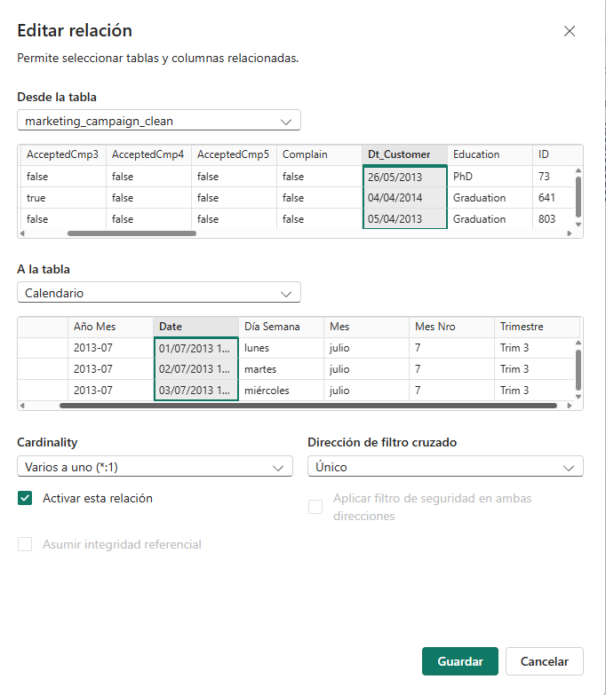

### Formateo de Métricas Financieras - INCOME A MONEDA
Antes de iniciar con el modelado avanzado, procedí a estandarizar la visualización de la columna Income para que refleje su naturaleza monetaria:

Configuración de Moneda: En la pestaña Herramientas de columnas, cambié el formato a Moneda ($),

Optimización de Lectura: Ajusté las posiciones decimales a 0. Esto permite que el tablero sea mucho más limpio visualmente, 
aunque internamente Power BI conserve la precisión de los decimales definidos originalmente en SQL como DECIMAL(10,2).

Impacto: Con este cambio, cualquier gráfico que utilice ingresos mostrará automáticamente el signo pesos, 
eliminando la necesidad de editar etiquetas manualmente en cada visualización.

### Creación de Tabla de Fechas (Calendario DAX)
Una vez que las métricas financieras estuvieron listas, creé una Tabla de Calendario para potenciar el análisis temporal del proyecto:

Propósito: Esta tabla es fundamental para utilizar funciones de Inteligencia de Tiempo (Time Intelligence) y evitar saltos en las líneas de tiempo si existen días sin registros en la columna Dt_Customer.

Implementación: Utilicé el siguiente script DAX para generar una tabla dinámica que se ajusta automáticamente al rango de fechas de los datos:

Calendario = 
VAR FechaInicio = MIN('marketing_campaign_clean'[Dt_Customer])
VAR FechaFin = MAX('marketing_campaign_clean'[Dt_Customer])
RETURN
ADDCOLUMNS (
    -- Generamos el rango de fechas base
    CALENDAR (FechaInicio, FechaFin),
    
    -- Agregamos la columna con el formato específico DD/MM/YYYY
    "Fecha Formateada", FORMAT([Date], "dd/mm/yyyy"),
    
    "Año", YEAR([Date]),
    "Mes Nro", MONTH([Date]),
    "Mes", FORMAT([Date], "MMMM"),
    "Trimestre", "Trim " & QUARTER([Date]),
    "Día Semana", FORMAT([Date], "dddd"),
    "Año Mes", FORMAT([Date], "YYYY-MM")
)

### Modelado de Datos: Relación de Inteligencia de Tiempo
El paso final de la arquitectura de datos consistió en vincular la tabla de hechos con la dimensión temporal para habilitar análisis comparativos y evolutivos.

Vinculación de Dt_Customer y Date
Conexión de Tablas: Establecí una relación física entre el campo Dt_Customer de la tabla marketing_campaign_clean y el campo Date de la tabla Calendario.

Tipo de Relación: La cardinalidad se configuró como Uno a Varios (1:*),
donde la tabla Calendario actúa como la "Dimensión" (valores únicos) y la tabla de marketing como los "Hechos" (múltiples registros por fecha).

Dirección de Filtro Única: Se definió que el flujo de filtrado sea desde Calendario hacia marketing_campaign_clean,
asegurando que cualquier selección de Año, Mes o Trimestre actualice automáticamente todas las métricas de la campaña.

 
